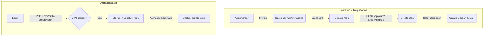
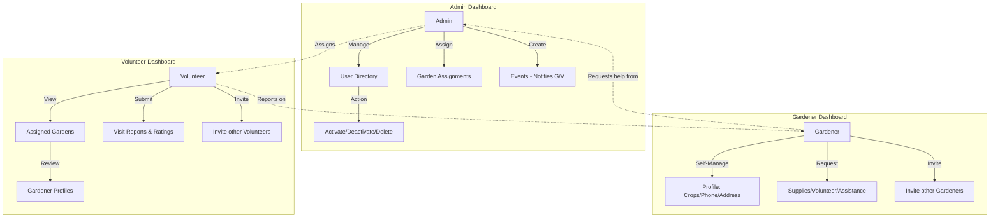

# User Management & Dashboard Flowcharts

This document outlines the user lifecycle and dashboard-specific interactions in the SS Garden App.

## 1. System-Wide Signup & Auth Flow

## 2. Dashboard User Management Flows

Each dashboard role has specific capabilities for managing profiles and interactions.

### Role Interaction Matrix

---

## 3. Detailed Dashboard Capabilities

### Admin Dashboard (`AdminDashboard.tsx`)
- **Directory Management**: Search and filter all users by role/status.
- **Account Control**: Ability to toggle `isActive` status or delete accounts.
- **Garden Linking**: Managing the bridge between `User` and `Garden` records via the `GardenGardener` model.
- **Cross-Role Notification**: Creating events that automatically notify Gardeners and Volunteers assigned to specific gardens.

### Gardener Dashboard (`GardenerDashboard.tsx`)
- **Profile Onboarding**: Primary place for users to update their "What I'm Growing" list (synced to `User.growing`).
- **Service Requests**: 
    - **Supplies**: Admin notification for tools/seeds.
    - **Volunteer Help**: Requests task-specific assistance.
    - **Assistance**: Access to Food/Utility support workflows.
- **Community Growth**: Invitations locked to the `Gardener` role.

### Volunteer Dashboard (`VolunteerDashboard.tsx`)
- **Assignment View**: Real-time access to gardens and specific gardeners assigned to them.
- **Visit Documentation**: The `Visit Report` flow updates the global report system (`/api/reports`), tracking visit dates and gardener performance/needs.
- **Peer Recruitment**: Invitations locked to the `Volunteer` role.

## 4. Technical Constraints
- **Role Scoping**: API actions check `req.user.role` to ensure volunteers cannot delete users and gardeners cannot create system-wide events.
- **Garden Context**: Frontend components (like Gardener requests) auto-detect `gardenId` from the user's assignment record to minimize form friction.
